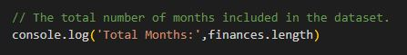
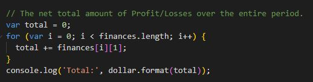
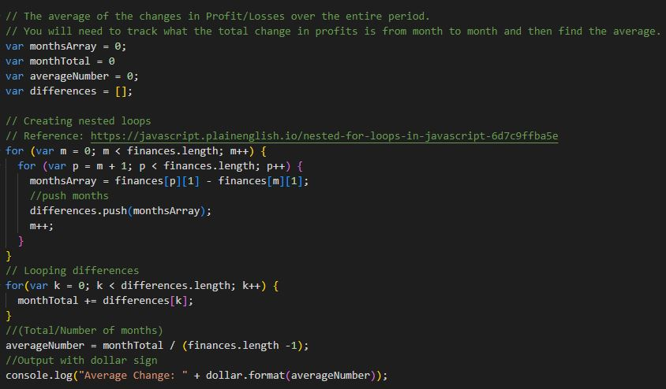
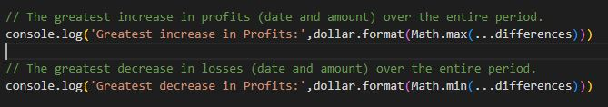
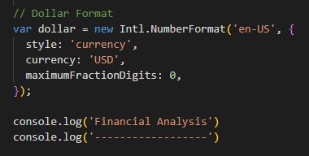
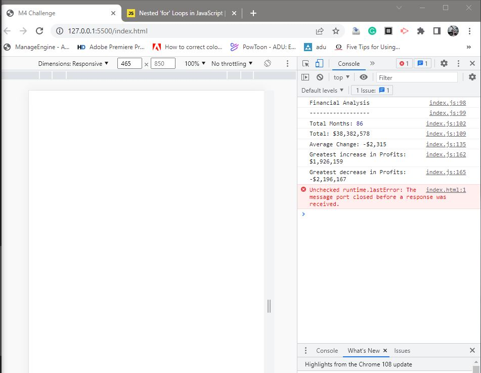

# Module 4 Challenge - Console Finances

## Task

* ### `The total number of months included in the dataset.`

* ### `The net total amount of Profit/Losses over the entire period.`

* ### `The average of the changes in Profit/Losses over the entire period.`
* ### `You will need to track what the total change in profits are from month to month and then find the average.`
* ### `(Total/Number of months)`
Reference: https://javascript.plainenglish.io/nested-for-loops-in-javascript-6d7c9ffba5e

Reference: https://stackoverflow.com/questions/54623431/find-the-biggest-number-in-an-array-by-using-javascript-loops
* ### `The greatest increase in profits (date and amount) over the entire period.`
* ### `The greatest decrease in losses (date and amount) over the entire period.`

## Added Currency and Divider

## Output

